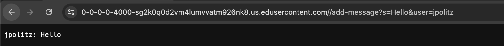
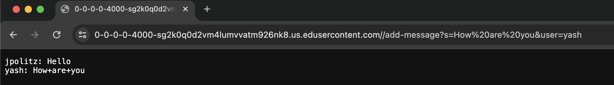

# Lab 2 Lab Report 

## Part 1

### Screenshot of ChatServer Code


### Two Screenshots of `/add-message`



### Which methods in your code are called?

The ```handleRequest``` method is called and inside the ```handleRequest``` method, `getPath`, `.equals`, `.getQuery`, `.split`, `isEmpty`, `.add` (from List)
and `String.join`. 

### What are the relevant arguments to those methods, and the values of any relevant fields of the class?

In ```handleRequest```, the relevant argument is the url that is passed in. Other methods like `getPath`, `getQuery`, `isEmpty` take no arguments. The method `.equals` takes in
the string that is being compared. The method `.split` takes in the character it should be split by (`&` in our case). The `.add` takes in the element that should be added to the 
list (the formatted string) and `String.join` takes in the new line character and the messages list and adds a line after each individual message. 

### How do the values of any relevant fields of the class change from this specific request? If no values got changed, explain why.

The url that is passed in does not change because we are not making any changes to the url. 
The .split method doesn't change anything as it instead gets the value from the split and stores it in an array. 
The add method from the List changes the messages list as it adds the string passed to the end of the list.
The String.join method doesn't change anything and it returns the new string formatted with the new line.
Other fields that change from this specific request are `user` and `message`, as those variables are based on what the user passes in. 
Other fields that change are the `parameters` array the `values` array as well as the `message` variable and the `messages` array. 




### Which methods in your code are called?

The ```handleRequest``` method is called and inside the ```handleRequest``` method, `getPath`, `.equals`, `.getQuery`, `.split`, `isEmpty`, `.add` (from List)

### What are the relevant arguments to those methods, and the values of any relevant fields of the class?

In ```handleRequest```, the relevant argument is the url that is passed in. Other methods like `getPath`, `getQuery`, `isEmpty` take no arguments. The method `.equals` takes in
the string that is being compared. The method `.split` takes in the character it should be split by (`&` in our case). The `.add` takes in the element that should be added to the 
list (the formatted string) and `String.join` takes in the new line character and the messages list and adds a line after each individual message. 

### How do the values of any relevant fields of the class change from this specific request? If no values got changed, explain why.

The url that is passed in does not change because we are not making any changes to the url. 
The .split method doesn't change anything as it instead gets the value from the split and stores it in an array. 
The add method from the List changes the messages list as it adds the string passed to the end of the list.
The String.join method doesn't change anything and it returns the new string formatted with the new line.
Other fields that change from this specific request are `user` and `message`, as those variables are based on what the user passes in. 
Other fields that change are the `parameters` array the `values` array as well as the `message` variable and the `messages` array. 
In this case, the new message that is passed in is added to the end of the `messages` list, which already has the first message that was created in the first URL request. 


## Part 2

### The absolute path to the private key for your SSH key

### The absolute path to the public key for your SSH key for logging into ieng6

### A terminal interaction where you log into your ieng6 account without being asked for a password.

## Part 3

I didn't know about the ssh key and how there is both the private and public ssh key. I learned that the public key is kept in the server while the private key is kept with the client. I also didn't know that the ssh key could be used to not enter the password everytime you try to connect to the remote server.
