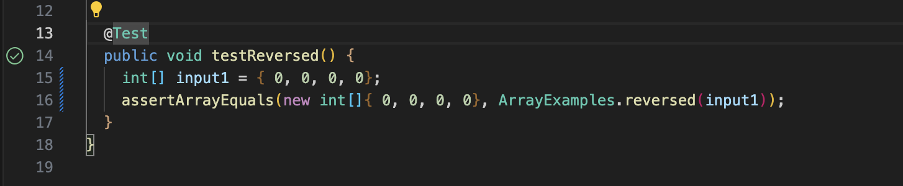

# Lab 3 Report 

## Part 1 - Bugs

### A failure-inducing input for the buggy program, as a JUnit test and any associated code (write it as a code block in Markdown)

A failure-inducing input for this problem is the array: 

```@Test
  public void testReversed() {
    int[] input1 = { 1, 2, 3, 4 };
    assertArrayEquals(new int[]{ 4, 3, 2, 1 }, ArrayExamples.reversed(input1));
  }
```

Instead of returning the array [4, 3, 2, 1], it returns [0,0,0,0] and clears the array. 

### An input that doesn't induce a failure, as a JUnit test and any associated code (write it as a code block in Markdown)

An input that doesn't induce a failure is [0,0,0,0]: 

```@Test
  public void testReversed() {
    int[] input1 = { 0, 0, 0, 0 };
    assertArrayEquals(new int[]{ 0, 0, 0, 0 }, ArrayExamples.reversed(input1));
  }
```

It properly returns the reverse of [0,0,0,0] which is the array [0,0,0,0].

### The symptom, as the output of running the tests (provide it as a screenshot of running JUnit with at least the two inputs above)

The symptom is that the method clears the array instead of reversing it. 





### The bug, as the before-and-after code change required to fix it (as two code blocks in Markdown)

Old code: 

```
static int[] reversed(int[] arr) {
    int[] newArray = new int[arr.length];
    for(int i = 0; i < arr.length; i += 1) {
      arr[i] = newArray[arr.length - i - 1];
    }
    return arr;
  }
```

Revised Code:

```
static int[] reversed(int[] arr) {
    int[] newArray = new int[arr.length];
    for(int i = 0; i < arr.length; i += 1) {
      newArray[i] = arr[arr.length - i - 1];
    }
    return newArray;
  }
```

## Part 2 - Researching Commands

### Option 2: Find (finding all directories) 

## Using ```-name```

#### find ./technical/911report -type f -name "*.png"

This finds all txt files in the ```911report``` folder in the technical folder. 

There is no output for this command as there are no png files.

Source Used: Linuxize

#### Example 2: ```find ./technical/911report -type f -name "*.txt"```

This finds all txt files in the ```cse15l-lab-reports``` folder: 

```
./technical/911report/chapter-13.4.txt
./technical/911report/chapter-13.5.txt
./technical/911report/chapter-13.1.txt
./technical/911report/chapter-13.2.txt
./technical/911report/chapter-13.3.txt
./technical/911report/chapter-3.txt
./technical/911report/chapter-2.txt
./technical/911report/chapter-1.txt
./technical/911report/chapter-5.txt
./technical/911report/chapter-6.txt
./technical/911report/chapter-7.txt
./technical/911report/chapter-9.txt
./technical/911report/chapter-8.txt
./technical/911report/preface.txt
./technical/911report/chapter-12.txt
./technical/911report/chapter-10.txt
./technical/911report/chapter-11.txt
```

This finds all the text files (of type `.txt`) in the `/technical/` directory. 

Source Used: Geeksforgeeks

## Using -exec

### Example 3: ```find ./technical -type f -name "*.txt" -exec rm {} \;```

This command finds all .txt files in the `/technical` folder and deletes them (using the `rm` command). When I go into the `/technical/911report/` there are no `.txt` files. 


Source Used: Linuxize

### Example 4: ```find ./technical -type d -exec chmod 755 {} \;```

This command finds all directiories in the `/.technical` directory and sets their permissions to 755, which means that the owner can read, write, and edit but others can 
read and execute. 

There is no output on the terminal. 

Source Used: Linuxize

## Using -mtime

### ```find ./technical -type f -mtime -7```

This command finds all the files and subdirectories within the `/.technical` directory that were modified in the last 7 days. Here is the output: 

```
./technical/government/About_LSC/LegalServCorp_v_VelazquezSyllabus.txt
./technical/government/About_LSC/Progress_report.txt
./technical/government/About_LSC/Strategic_report.txt
./technical/government/About_LSC/Comments_on_semiannual.txt
./technical/government/About_LSC/Special_report_to_congress.txt
./technical/government/About_LSC/CONFIG_STANDARDS.txt
./technical/government/About_LSC/commission_report.txt
./technical/government/About_LSC/LegalServCorp_v_VelazquezDissent.txt
./technical/government/About_LSC/ONTARIO_LEGAL_AID_SERIES.txt
./technical/government/About_LSC/LegalServCorp_v_VelazquezOpinion.txt
./technical/government/About_LSC/diversity_priorities.txt
./technical/government/About_LSC/reporting_system.txt
./technical/government/About_LSC/State_Planning_Report.txt
./technical/government/About_LSC/Protocol_Regarding_Access.txt
./technical/government/About_LSC/ODonnell_et_al_v_LSCdecision.txt
./technical/government/About_LSC/conference_highlights.txt
./technical/government/About_LSC/State_Planning_Special_Report.txt
.
.
.
./technical/911report/chapter-12.txt
./technical/911report/chapter-10.txt
./technical/911report/chapter-11.txt
```

Source Used: Linuxize

### ```find ./technical -type d -mtime +30```

This command finds all the directories within the `/.technical` directory that were modified more than 30 days ago. The output is nothing as there was no file that was modified more than 30 days ago. 

Source Used: Linuxize

## Using Size

### ```find ./technical -type f -size -1M``` 

This finds all the files smaller than 1MB. Here is the output: 

```
./technical/government/About_LSC/LegalServCorp_v_VelazquezSyllabus.txt
./technical/government/About_LSC/Progress_report.txt
./technical/government/About_LSC/Strategic_report.txt
./technical/government/About_LSC/Comments_on_semiannual.txt
./technical/government/About_LSC/Special_report_to_congress.txt
./technical/government/About_LSC/CONFIG_STANDARDS.txt
./technical/government/About_LSC/commission_report.txt
./technical/government/About_LSC/LegalServCorp_v_VelazquezDissent.txt
./technical/government/About_LSC/ONTARIO_LEGAL_AID_SERIES.txt
./technical/government/About_LSC/LegalServCorp_v_VelazquezOpinion.txt
./technical/government/About_LSC/diversity_priorities.txt
./technical/government/About_LSC/reporting_system.txt
./technical/government/About_LSC/State_Planning_Report.txt
./technical/government/About_LSC/Protocol_Regarding_Access.txt
./technical/government/About_LSC/ODonnell_et_al_v_LSCdecision.txt
./technical/government/About_LSC/conference_highlights.txt
./technical/government/About_LSC/State_Planning_Special_Report.txt
.
.
.
./technical/911report/chapter-12.txt
./technical/911report/chapter-10.txt
./technical/911report/chapter-11.txt
```

Source Used: Linuxize

### ```find ./technical -type f -size -10M```

This finds all the files smaller than 10MB in the technical directory. Here is the output: 

```
./technical/government/About_LSC/LegalServCorp_v_VelazquezSyllabus.txt
./technical/government/About_LSC/Progress_report.txt
./technical/government/About_LSC/Strategic_report.txt
./technical/government/About_LSC/Comments_on_semiannual.txt
./technical/government/About_LSC/Special_report_to_congress.txt
./technical/government/About_LSC/CONFIG_STANDARDS.txt
./technical/government/About_LSC/commission_report.txt
./technical/government/About_LSC/LegalServCorp_v_VelazquezDissent.txt
./technical/government/About_LSC/ONTARIO_LEGAL_AID_SERIES.txt
./technical/government/About_LSC/LegalServCorp_v_VelazquezOpinion.txt
./technical/government/About_LSC/diversity_priorities.txt
./technical/government/About_LSC/reporting_system.txt
./technical/government/About_LSC/State_Planning_Report.txt
./technical/government/About_LSC/Protocol_Regarding_Access.txt
./technical/government/About_LSC/ODonnell_et_al_v_LSCdecision.txt
./technical/government/About_LSC/conference_highlights.txt
./technical/government/About_LSC/State_Planning_Special_Report.txt
./technical/government/Env_Prot_Agen/multi102902.txt
./technical/government/Env_Prot_Agen/section-by-section_summary.txt
./technical/government/Env_Prot_Agen/jeffordslieberm.txt
./technical/government/Env_Prot_Agen/final.txt
./technical/government/Env_Prot_Agen/ctf7-10.txt
./technical/government/Env_Prot_Agen/ctf1-6.txt
./technical/government/Env_Prot_Agen/ro_clear_skies_book.txt
./technical/government/Env_Prot_Agen/ctm4-10.txt
./technical/government/Env_Prot_Agen/1-3_meth_901.txt
./technical/government/Env_Prot_Agen/atx1-6.txt
./technical/government/Env_Prot_Agen/tech_sectiong.txt
./technical/government/Env_Prot_Agen/bill.txt
./technical/government/Env_Prot_Agen/nov1.txt
./technical/government/Env_Prot_Agen/tech_adden.txt
./technical/government/Alcohol_Problems/Session2-PDF.txt
./technical/government/Alcohol_Problems/Session3-PDF.txt
./technical/government/Alcohol_Problems/DraftRecom-PDF.txt
./technical/government/Alcohol_Problems/Session4-PDF.txt
.
.
.
./technical/911report/chapter-7.txt
./technical/911report/chapter-9.txt
./technical/911report/chapter-8.txt
./technical/911report/preface.txt
./technical/911report/chapter-12.txt
./technical/911report/chapter-10.txt
./technical/911report/chapter-11.txt
```

## Using Empty 

### ```find ./technical -type f -empty```

This command finds all empty files within the `/.technical` directory. It outputs nothing in this case because there are no empty files.

Source Used: Geeksforgeeks


### ```find ./technical -type d -empty``` 

This command lists all empty directories within the `/.technical` directory. It also outputs nothing in this case because there are no empty directories. 
