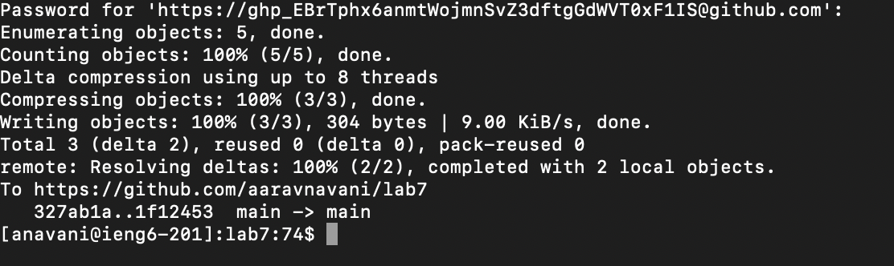

# Lab Report 4

## Step 4


For this, I just ran ```ssh anavani@ieng6.ucsd.edu <Enter>``` to ssh into the ieng6 server. 

## Step 5


This clones the forked lab7 repo into the ieng6 home directory. For this, the keys pressed was ```git clone git@github.com:aaravnavani/lab7.git <Enter> <Enter>```  


## Step 6


Here are the keys pressed: 
```cd lab7 <Enter>```
```ls<Enter>```
```<up>```, ```<up>```, ```<up>```, ```<up>```, ```<up>```, ```<up>```, ```<up>```, ```<up>```, ```<up>```, ```<up>```, ```<up>```, ```<up>```, ```<up>```, ```<up>```, ```<up>```, ```<up>```, ```<up>```
```<up>```, ```<up>```, ```<up>```, ```<up>```, ```<up>```, ```<up>```, ```<up>```, ```<up>```, ```<up>```, ```<up>```, ```<up>```, ```<up>```, ```<up>```, ```<up>```, ```<up>```, ```<up>```, ```<up>```

I did ```cd lab7``` in order to go into the lab7 directory. I then did ```ls``` to check the directories inside the ```lab7``` folder. I then did ```vim test.sh``` to view the file, then ```:wq! <Enter>``` to exit vim. Then I ran, ```bash test.sh``` to run the tester file. 

## Step 7

I press ```vim ListExamples.java```, ```<enter>```, ```42j```, ```<down>```, ```<right> <right>```, ```e```, ```r2```, ```:wq!```, and ```<enter>```. 
The vim command was used to open ```ListExamples.java``` in the vim editor. 
I then used ```42j``` and ```<enter>``` to jump to 42nd line. 
I then pressed ```<down>``` and ```<right>``` twice to get to the first character of the line that needs changes. Then I pressed ```e``` to get to the end of the line and ```r2``` to replace 1 with 2.
Finally, I did ```:wq!``` and ```<enter>``` to save the changes to the file and exit vim.


## Step 8


Key pressed: ```<up>```,```<up>```, ```<up>```, ```<up>```, ```<up>```, ```<up>```, ```<enter>``` and then ```<up>```,```<up>```, ```<up>```, ```<up>```, ```<up>```, ```<up>```, ```<enter>```

The ```javac -cp.:lib/hamcrest-core-1.3.jar:lib/junit-4.13.2.jar *.java``` was 6 up in the terminal commands history and I used this command to compile the java files. I then use ```java -cp.:lib/hamcrest-core-1.3.jar:lib/junit-4.13.2.jar org.junit.runner.JUnitCore ListExamplesTests``` to run the tester. 

## Step 9



I pressed ```git add ListExamples.java <enter>```, ```git commit -m "update list examples file"```, ```<enter>```, ```git push```. This adds the changes from ```ListExamples.java```, stages those changes, commits those changes with the commit message, and then pushes it to the repository.  
